<picture>
  <source media="(prefers-color-scheme: dark)" srcset="./assets/header-dark.svg">
  
</picture>

<picture>
  <source media="(prefers-color-scheme: dark)" srcset="https://readme-typing-svg.demolab.com?font=JetBrains+Mono&size=15&duration=2600&pause=1400&color=FF7A45&vCenter=true&width=480&height=26&lines=Drupal+de+dia%2C+React+Native+de+noite;git+commit+-m+%22agora+vai%22">
  
</picture>

Dev front-end e mobile na Squadra Digital. Estudando ADS no Cotemig e Ciência da Computação.

<picture>
  <source media="(prefers-color-scheme: dark)" srcset="https://raw.githubusercontent.com/davimurta/davimurta/output/snake-dark.svg">
  
</picture>

  <a href="https://www.linkedin.com/in/davimurta/">LinkedIn</a> &nbsp;·&nbsp;
  <a href="mailto:davimurta@gmail.com">E-mail</a> &nbsp;·&nbsp;
  <a href="https://www.instagram.com/davilamounier_/">Instagram</a>

