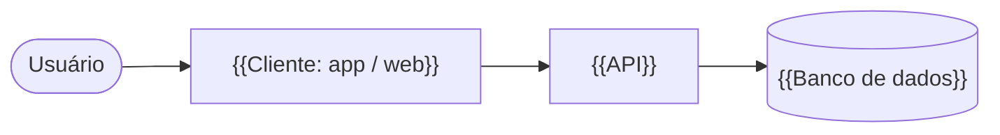

<!--
  Template de README de projeto — Davi Murta.
  Tudo entre {{chaves duplas}} é placeholder: substitua ou apague a linha.
  Antes de publicar, rode `grep -rn "{{" .` e siga o templates/CHECKLIST.md.
  Apague este comentário e os comentários de instrução ao terminar.
-->

# {{Nome do projeto}}

<!-- Uma linha: o que é e para quem. Sem adjetivo genérico. -->
{{Tagline: o que o projeto faz, em uma frase.}}

<!-- Status: em desenvolvimento | estável | arquivado. Stack: só as peças principais. -->


<!-- Screenshot ou GIF da tela principal. Guarde em docs/assets/. Alt text descreve a tela. -->
<p align="center">
  
</p>

## Sobre

<!-- 3 a 5 linhas: qual problema existe, para quem, como o projeto resolve. -->
{{Problema.}} {{Para quem.}} {{Como resolve.}}

## Funcionalidades

<!-- Só o que já funciona. O que é plano vai em "Status e roadmap". -->
- {{Funcionalidade}}
- {{Funcionalidade}}

## Stack e por quê

<!-- Uma linha por escolha importante, com o motivo. -->
| Peça | Por quê |
| --- | --- |
| {{Next.js}} | {{Motivo concreto da escolha}} |
| {{PostgreSQL + Prisma}} | {{Motivo concreto da escolha}} |

## Arquitetura

<!-- Visão de alto nível. O detalhe fica em docs/ARCHITECTURE.md. -->


Detalhes em [docs/ARCHITECTURE.md](./docs/ARCHITECTURE.md).

## Documentação

- [Histórias de usuário](./docs/USER_STORIES.md)
- [Casos de uso](./docs/USE_CASES.md)
- [Decisões de arquitetura (ADRs)](./docs/adr/)

## Como rodar

### Pré-requisitos

<!-- Versões exatas. -->
- {{Node.js 20+}}
- {{PostgreSQL 16}}

### Passos

<!-- Teste do zero, num clone limpo, antes de publicar. -->
1. Clone o repositório:
   ```bash
   git clone https://github.com/davimurta/{{repo}}.git
   cd {{repo}}
   ```
2. Instale as dependências:
   ```bash
   {{npm install}}
   ```
3. Copie as variáveis de ambiente e preencha:
   ```bash
   cp .env.example .env
   ```
4. {{Rode as migrações / seed, se houver.}}
5. Suba o projeto:
   ```bash
   {{npm run dev}}
   ```

### Variáveis de ambiente

<!-- Espelho do .env.example. Nunca coloque valores reais aqui nem no .env.example. -->
| Variável | Para que serve |
| --- | --- |
| `{{DATABASE_URL}}` | {{Conexão com o banco}} |

## Testes

<!-- Comando e o que é coberto. Se não houver testes, diga isso. -->
```bash
{{npm test}}
```

## Status e roadmap

<!-- Onde o projeto está e os próximos passos reais. -->
- [x] {{Entregue}}
- [ ] {{Próximo passo}}

## Decisões e aprendizados

<!-- O que foi feito diferente do óbvio e por quê. Link para o ADR quando existir. -->
- **{{Decisão}}:** {{por que, e o que aprendi}}. Ver [ADR 0001](./docs/adr/0001-{{slug}}.md).

## Autores

<!-- Nome, papel e GitHub. Nada de matrícula, telefone ou e-mail pessoal. -->
| Nome | Papel | GitHub |
| --- | --- | --- |
| Davi Murta | {{Front-end e arquitetura}} | [@davimurta](https://github.com/davimurta) |

## Licença

{{MIT}} — ver [LICENSE](./LICENSE).
