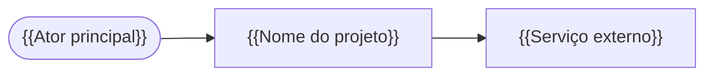
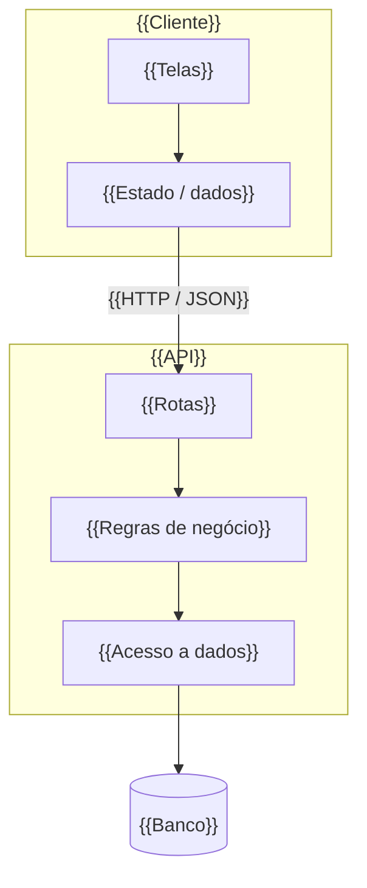
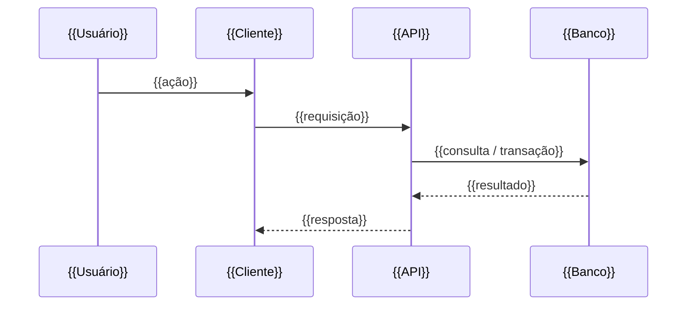

# Arquitetura — {{Nome do projeto}}

## Contexto

<!-- O sistema, quem usa e com quais sistemas externos conversa. -->
{{Descrição em 3 a 5 linhas.}}

## Containers e componentes

<!-- As peças que rodam separadas (app, API, banco, filas) e os módulos principais de cada uma. -->

| Componente | Responsabilidade |
| --- | --- |
| {{Componente}} | {{O que faz e o que não faz}} |

## Fluxo de dados

<!-- Um fluxo crítico, passo a passo. -->

## Decisões principais

<!-- Resumo de uma linha por decisão, com link para o ADR. -->
| Decisão | ADR |
| --- | --- |
| {{Decisão}} | [0001](./adr/0001-{{slug}}.md) |
